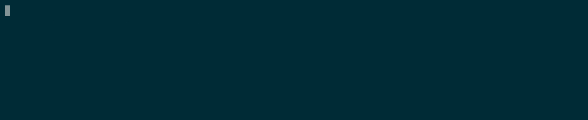

# Studio2-ScanOps-PortScanner
Artifact for our project in Studio 2



## Getting started.

You probably want to create a virtual environment first, and source it, for instance like:

```bash
virtualenv -p /usr/bin/python3 .venv-python
source ./.venv-python/bin/activate
```

then install the dependencies with pip

```bash
pip install -r requirements.txt
```

You should now be ready to run the application:

## Usage

Run it with 

```bash
ython main.py -t 127.1 -p "1-10000" tcp_scan

```

```bash
usage: scanops [-h] -t TARGET [-p PORTS] [-c CONCURRENT] [- TIMEOUT_MS] {http_scan,tcp_scan} ...

ScanOps

positional arguments:
  {http_scan,tcp_scan}
    http_scan           Scan ports over HTTP
    tcp_scan            Scan ports over TCP

options:
  -h, --help            show this help message and exit
  -t, --target TARGET   Target IP/hostname to scan
  -p, --ports PORTS     Ports to scan (e.g. "80,443,8080" or "20-1000")
  -c, --concurrent CONCURRENT
                        Number of concurrent scans
  -, --timeout_ms TIMEOUT_MS
                        Timeout in ms.
  ```

### Subcommands

#### HTTP Scanning

```bash
usage: scanops http_scan [-h] [-m METHOD] [-s STATUS_CODE_FILTER] [-S STATUS_CODE_IGNORE_FILTER] [--proxy PROXY]

options:
  -h, --help            show this help message and exit
  -m, --method METHOD   HTTP-verb to use for scanning
  -s, --status-code-filter STATUS_CODE_FILTER
                        Allows filtering by status-code. Can be comma-separated, or a range (eg. "200,205" or "200-499")
  -S, --status-code-ignore-filter STATUS_CODE_IGNORE_FILTER
                        Allows ignoring responses by status-code. Can be comma-separated, or a range (eg. "200,205" or "200-499")
  --proxy PROXY         Proxy URL (e.g. "http://proxy:8080")
```

#### TCP Scanning

```bash
usage: scanops tcp_scan [-h]

options:
  -h, --help  show this help message and exit
```


### Project structure

The project is structured in a modular way. This keeps each module simple, but does require each module to adhere to fixed interfaces.

`main.py` is the entrypoint of the program. It handles parsing of input from the user, 
instantiates specific implementations of modules.

Scanners are implementation of a certain type of scanner. Currently, only the HTTP-scanner is implemented.
These are responsible for handling the specifics of performing an actual scan on a single port.

Reporters are responsible for reporting on the progress during a scan, when it starts, as well as when it is complete. 
